# Hidden States Flow in GAE-PPO for OpenVLA

This document explains how hidden states are extracted from the VLA model and used by the value head for dense reward PPO training.

## Overview

The **hidden states** are the VLA's internal representation of the current state (observation + instruction) at the position right before action token generation. This representation captures:
- Full understanding of the visual scene (from vision patches)
- Full understanding of the task instruction (from language tokens)
- The model's internal "belief state" about what action to take

The value head uses these hidden states to estimate the expected future reward: V(s) = "how good is this state?"

---

## Complete Flow Diagram

```mermaid
flowchart TB
    subgraph Input["1. Input Processing"]
        OBS[("Observation<br/>(image + proprio)")]
        INST[("Instruction<br/>'pick up the cup'")]
    end

    subgraph VisionProcessing["2. Vision Encoding"]
        IMG_PROC["Image Processor<br/>(224x224 RGB)"]
        VIS_BACKBONE["Vision Backbone<br/>(DinoV2)"]
        VIS_PATCHES["Vision Patches<br/>(num_patches, 768)"]
        VIS_PROJ["Vision Projector<br/>(768 → 4096)"]

        OBS --> IMG_PROC
        IMG_PROC --> VIS_BACKBONE
        VIS_BACKBONE --> VIS_PATCHES
        VIS_PATCHES --> VIS_PROJ
    end

    subgraph LanguageProcessing["3. Language Encoding"]
        PROMPT["Prompt Builder<br/>'IN: pick up the cup\nOUT:'"]
        TOKENIZER["Tokenizer<br/>(Llama)"]
        TEXT_TOKENS["Text Tokens<br/>(seq_len,)"]
        TEXT_EMBED["Token Embeddings<br/>(seq_len, 4096)"]

        INST --> PROMPT
        PROMPT --> TOKENIZER
        TOKENIZER --> TEXT_TOKENS
        TEXT_TOKENS --> TEXT_EMBED
    end

    subgraph ProprioProcessing["4. Proprioception (Optional)"]
        PROPRIO["Proprio State<br/>(8D joint angles)"]
        PROPRIO_PROJ["Proprio Projector<br/>(8 → 4096)"]
        PROPRIO_FEAT["Proprio Feature<br/>(1, 4096)"]

        OBS --> PROPRIO
        PROPRIO --> PROPRIO_PROJ
        PROPRIO_PROJ --> PROPRIO_FEAT
    end

    subgraph MultimodalFusion["5. Multimodal Fusion"]
        CONCAT["Concatenate Embeddings"]
        MM_SEQ["Multimodal Sequence<br/>[patches | proprio | text | actions]"]

        VIS_PROJ --> CONCAT
        PROPRIO_FEAT -.-> CONCAT
        TEXT_EMBED --> CONCAT
        CONCAT --> MM_SEQ
    end

    subgraph LLMProcessing["6. Language Model Processing"]
        LLM["LLaMA-2 7B<br/>(with LoRA adapters)"]
        LLM_OUT["LLM Output<br/>(hidden_states, logits)"]

        MM_SEQ --> LLM
        LLM --> LLM_OUT
    end

    subgraph SequencePositions["7. Sequence Position Breakdown"]
        direction LR
        SEQ_VIS["[0:NUM_PATCHES]<br/>Vision Patches"]
        SEQ_PROPRIO["[NUM_PATCHES]<br/>Proprio (if used)"]
        SEQ_TEXT["[NUM_PATCHES+1:...+PROMPT_LEN]<br/>Instruction Text"]
        SEQ_LAST["[...:PROMPT_LEN-1]<br/>⭐ LAST PROMPT TOKEN<br/>(value hidden state)"]
        SEQ_ACTION["[PROMPT_LEN:PROMPT_LEN+56]<br/>Action Tokens<br/>(to be generated)"]

        LLM_OUT --> SEQ_VIS
        SEQ_VIS --> SEQ_PROPRIO
        SEQ_PROPRIO --> SEQ_TEXT
        SEQ_TEXT --> SEQ_LAST
        SEQ_LAST --> SEQ_ACTION
    end

    subgraph HiddenStatesExtraction["8. Hidden States Extraction"]
        EXTRACT["Extract Last Layer<br/>hidden_states[-1]"]
        INDEX["Index Position<br/>[NUM_PATCHES + NUM_PROMPT_TOKENS - 1]"]
        VALUE_HIDDEN["Value Hidden State<br/>(batch, 4096)<br/>⭐ KEY OUTPUT"]

        LLM_OUT --> EXTRACT
        EXTRACT --> INDEX
        SEQ_LAST -.-> INDEX
        INDEX --> VALUE_HIDDEN
    end

    subgraph ActionGeneration["9. Action Token Generation (Parallel)"]
        ACTION_LOGITS["Extract Action Logits<br/>[PROMPT_LEN:PROMPT_LEN+56, -256:]"]
        SAMPLE["Sample/Argmax<br/>Temperature = 1.6"]
        ACTION_TOKENS["Action Token IDs<br/>(56,) in [31744, 32000]"]
        DETOKENIZE["Detokenize<br/>bin_centers lookup"]
        CONTINUOUS["Continuous Actions<br/>(8, 7) in [-1, 1]"]

        LLM_OUT --> ACTION_LOGITS
        ACTION_LOGITS --> SAMPLE
        SAMPLE --> ACTION_TOKENS
        ACTION_TOKENS --> DETOKENIZE
        DETOKENIZE --> CONTINUOUS
    end

    subgraph ValuePrediction["10. Value Prediction (GAE-PPO)"]
        VALUE_HEAD["Value Head MLP<br/>(4096 → 1024 → 512 → 1)"]
        VALUE_EST["Value Estimate<br/>V(s) = scalar<br/>'Expected future reward'"]

        VALUE_HIDDEN --> VALUE_HEAD
        VALUE_HEAD --> VALUE_EST
    end

    subgraph Storage["11. Storage in Trajectory Buffer"]
        BUFFER["TrajectoryBuffer.add()<br/>- obs<br/>- action<br/>- reward<br/>- log_prob<br/>⭐ value (from VALUE_EST)<br/>- hidden_states (cached)"]

        CONTINUOUS --> BUFFER
        VALUE_EST --> BUFFER
        VALUE_HIDDEN -.-> BUFFER
    end

    subgraph GAE["12. GAE Advantage Computation"]
        GAE_COMPUTE["compute_gae()<br/>A(s,a) = Σ(γλ)^t * δ_t<br/>δ_t = r_t + γV(s_{t+1}) - V(s_t)"]
        ADVANTAGES["Advantages<br/>(trajectory_len,)"]

        BUFFER --> GAE_COMPUTE
        GAE_COMPUTE --> ADVANTAGES
    end

    subgraph PolicyUpdate["13. Policy Update (PPO Loss)"]
        RECOMPUTE["Recompute Forward Pass<br/>(with gradients enabled)"]
        NEW_LOGPROB["New Log Prob<br/>π_θ(a|s)"]
        NEW_VALUE["New Value<br/>V_θ(s)"]

        POLICY_LOSS["Policy Loss<br/>L_CLIP = -min(r*A, clip(r)*A)"]
        VALUE_LOSS["Value Loss<br/>L_VALUE = MSE(V, returns)"]
        TOTAL_LOSS["Total Loss<br/>L = L_CLIP + 0.5*L_VALUE"]

        BUFFER --> RECOMPUTE
        RECOMPUTE --> NEW_LOGPROB
        RECOMPUTE --> NEW_VALUE

        NEW_LOGPROB --> POLICY_LOSS
        ADVANTAGES --> POLICY_LOSS

        NEW_VALUE --> VALUE_LOSS
        GAE_COMPUTE --> VALUE_LOSS

        POLICY_LOSS --> TOTAL_LOSS
        VALUE_LOSS --> TOTAL_LOSS
    end

    subgraph Optimization["14. Optimization"]
        ACTOR_OPT["Actor Optimizer<br/>(LoRA params, LR=1e-5)"]
        CRITIC_OPT["Critic Optimizer<br/>(Value head params, LR=3e-4)"]

        TOTAL_LOSS --> ACTOR_OPT
        TOTAL_LOSS --> CRITIC_OPT
    end

    style VALUE_HIDDEN fill:#ff6b6b,stroke:#c92a2a,stroke-width:3px,color:#fff
    style SEQ_LAST fill:#ff6b6b,stroke:#c92a2a,stroke-width:2px
    style VALUE_EST fill:#4ecdc4,stroke:#0f9d8a,stroke-width:3px
    style VALUE_HEAD fill:#4ecdc4,stroke:#0f9d8a,stroke-width:2px
    style ADVANTAGES fill:#ffe66d,stroke:#f4a261,stroke-width:2px
```



---

## Key Implementation Details

### Position Indexing

The multimodal sequence has the following structure:

```
Position:  |0        ...   NUM_PATCHES| N_P+1   ...   N_P+PROMPT_LEN-1 | N_P+PROMPT_LEN   ...   N_P+PROMPT_LEN+56|
Content:   |    Vision Patches        |    Instruction Tokens          |      Action Tokens (generated)         |
           |  (e.g., 729 patches)     |  (e.g., 15 tokens)             |      (56 tokens: 7 dims * 8 actions)   |
```

**Value Hidden State Position:** `NUM_PATCHES + NUM_PROMPT_TOKENS - 1`
- This is the **last instruction token**
- At this position, the model has processed:
  - ✅ All vision patches (full visual understanding)
  - ✅ All instruction tokens (full language understanding)
  - ❌ NOT yet generated action tokens (no circular dependency)

### Code Location: `OpenVLA_PPO.py:883-893`

```python
# Extract hidden states for value function (GAE-PPO)
# Get last layer's hidden states: (batch_size, seq_len, hidden_dim=4096)
last_hidden_states = language_model_output.hidden_states[-1]

# Extract hidden state at the position right before action generation
# Position breakdown:
#   [0:NUM_PATCHES] - vision patch embeddings
#   [NUM_PATCHES:NUM_PATCHES+NUM_PROMPT_TOKENS] - instruction prompt tokens
#   [NUM_PATCHES+NUM_PROMPT_TOKENS:...] - action tokens (to be generated)
# We want the last prompt token's hidden state (has full vision + language context)
value_hidden_state = last_hidden_states[:, NUM_PATCHES + NUM_PROMPT_TOKENS - 1, :]  # (batch, 4096)
```

### Return Dictionary: `OpenVLA_PPO.py:939-948`

```python
return {
    'logits': action_token_logits,
    'responses': responses[0],  # (action_dim * action_chunk,)
    'log_prob': log_prob[0],  # Scalar tensor
    'continuous_actions': continuous_actions,  # (8, 7) - all 8 actions
    'input_ids': input_ids,
    'attention_mask': attention_mask,
    'pixel_values': pixel_values,
    'hidden_states': value_hidden_state[0],  # (4096,) - for value head input ⭐
}
```

---

## Usage in Different Phases

### Phase 1: Rollout Collection (`collect_rollouts`)

**Single Environment:** `OpenVLA_PPO.py:1485-1500`
```python
# Compute value estimate if using GAE
if self.cfg.use_gae:
    # Use cached hidden states from action_info
    if 'hidden_states' in self.current_action_info:
        hidden_states = self.current_action_info['hidden_states']
        value_estimate = self.value_head(hidden_states).item()
```

**Vectorized Environment:** `OpenVLA_PPO.py:1354-1369`
```python
# Compute value estimate if using GAE
if self.cfg.use_gae:
    # Use cached hidden states from action_info
    if 'hidden_states' in action_info:
        hidden_states = action_info['hidden_states']
        value_estimate = self.value_head(hidden_states).item()
```

### Phase 2: Advantage Computation

The trajectory buffer uses the stored values to compute GAE advantages:

```python
# trajectory_buffer.compute_advantages() calls:
advantages, returns = gae_ext.compute_gae_advantages(
    rewards=rewards,
    values=values,  # ⭐ From value_head(hidden_states)
    dones=dones,
    normalize=True,
)
```

### Phase 3: Policy Update (`update_policy`)

**Location:** `OpenVLA_PPO.py:1844-1871`

```python
if self.cfg.use_gae:
    # Recompute forward pass for each minibatch sample
    for i, idx in enumerate(mb_indices_cpu):
        obs = data["observations"][idx.item()]

        # Get action data (includes hidden states)
        action_data = self.predict_action_tokens_with_grad(
            obs=obs,
            task_prompt=task_prompt,
            temperature=self.cfg.rollout_temperature,
            sample=False,
        )

        # Extract hidden states and compute value
        hidden_states = action_data['hidden_states']  # ⭐
        value_est = self.value_head(hidden_states)
        batch_values.append(value_est)

    # Compute value loss
    value_loss = self.gae_ext.compute_value_loss(batch_values, mb_returns)
```

---

## Why This Design?

### 1. **Efficient Caching During Rollout**
- Hidden states are computed once during action prediction
- Cached in `action_info['hidden_states']`
- Reused for value estimation (no redundant forward passes)

### 2. **Gradients During Training**
- Policy update recomputes forward pass with `torch.set_grad_enabled(True)`
- Allows gradients to flow through VLA → Value Head
- Enables end-to-end training of critic

### 3. **No Circular Dependency**
- Value estimation uses state BEFORE action generation
- V(s) predicts future reward, doesn't depend on chosen action
- Matches standard RL formulation

### 4. **Shared Representation**
- Actor and critic share VLA backbone
- Value head learns from same features as policy
- More sample-efficient than separate networks

---

## Dimensions Summary

| Component | Shape | Description |
|-----------|-------|-------------|
| `obs['image']` | `(224, 224, 3)` | RGB observation |
| `obs['proprio']` | `(8,)` | Joint angles (axis-angle) |
| Vision patches | `(NUM_PATCHES, 768)` | DinoV2 output |
| Projected patches | `(NUM_PATCHES, 4096)` | After projection |
| Prompt tokens | `(PROMPT_LEN, 4096)` | Text embeddings |
| Multimodal sequence | `(NUM_PATCHES+PROMPT_LEN+56, 4096)` | Full sequence |
| **Value hidden state** | **(4096,)** | **Last prompt token** ⭐ |
| Value head output | `(1,)` | Scalar value estimate |
| Action tokens | `(56,)` | 7 dims × 8 actions |
| Continuous actions | `(8, 7)` | Detokenized actions |

---

## Configuration

Enable GAE-PPO in `configs/gae_ppo_config.yaml`:

```yaml
# GAE-Specific Settings
use_gae: true
gae_lambda: 0.95
freeze_vla_for_critic: false

# Learning Rates
actor_lr: 1.0e-5   # VLA LoRA adapters
critic_lr: 3.0e-4  # Value head (higher LR, trains from scratch)

# PPO Settings
gamma: 0.99
value_loss_coef: 0.5
```

---

## Testing

Run a quick test:

```bash
python start_gae_ppo_training.py --task-id 0 --timesteps 1000 --no-wandb
```

Expected output:
```
✓ Value head initialized (4.2M parameters)
✓ GAE extensions created (actor_lr=1e-5, critic_lr=3e-4)
✓ Trajectory buffer patched for GAE

[Rollout] Using cached hidden_states for value estimation
  Value estimate: 0.0234 (from hidden state shape (4096,))

[Training] Recomputing forward pass for value gradients
  Policy loss: 0.0123
  Value loss: 0.0045
  Total loss: 0.0145
```

---

## Summary

The hidden states flow enables **dense reward PPO** by:

1. **Extracting** the VLA's internal representation at the last prompt token
2. **Caching** these states during rollout collection
3. **Using** them for efficient value estimation
4. **Recomputing** them during training for gradient flow
5. **Training** both actor (policy) and critic (value) end-to-end

This design combines the best of both worlds:
- ✅ **Efficiency:** Cache hidden states during rollout
- ✅ **Correctness:** Recompute with gradients during training
- ✅ **Stability:** Separate optimizers with different learning rates
